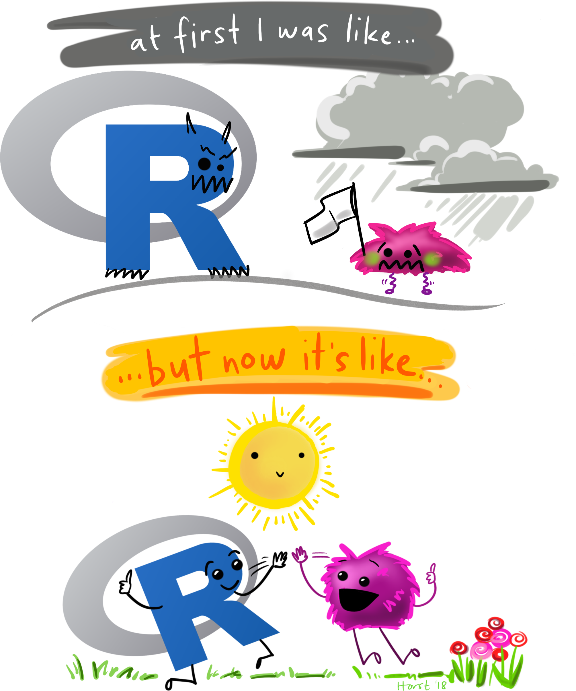
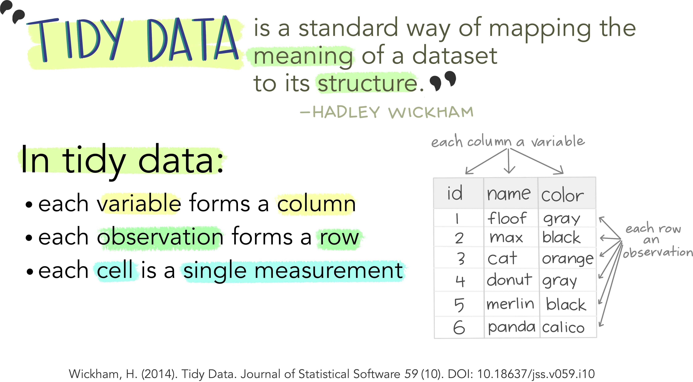
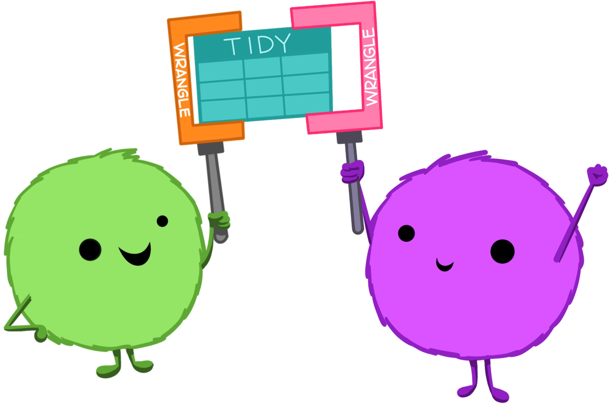
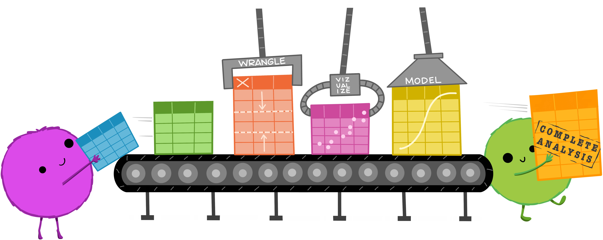
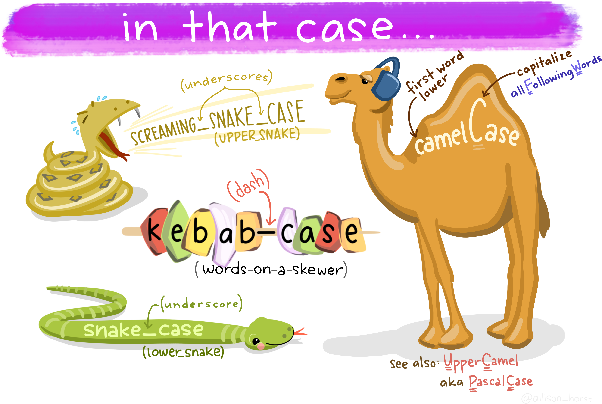
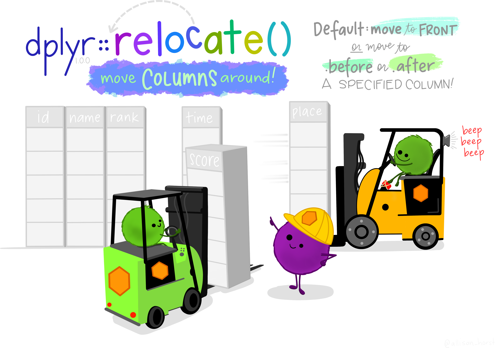
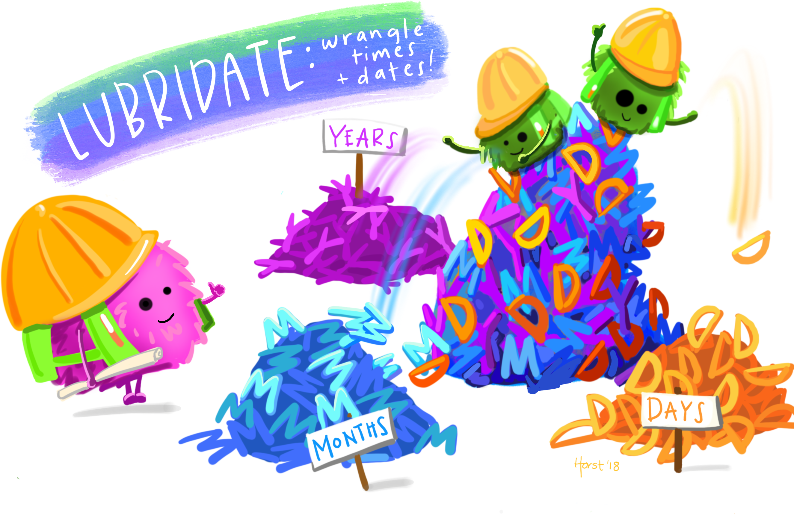
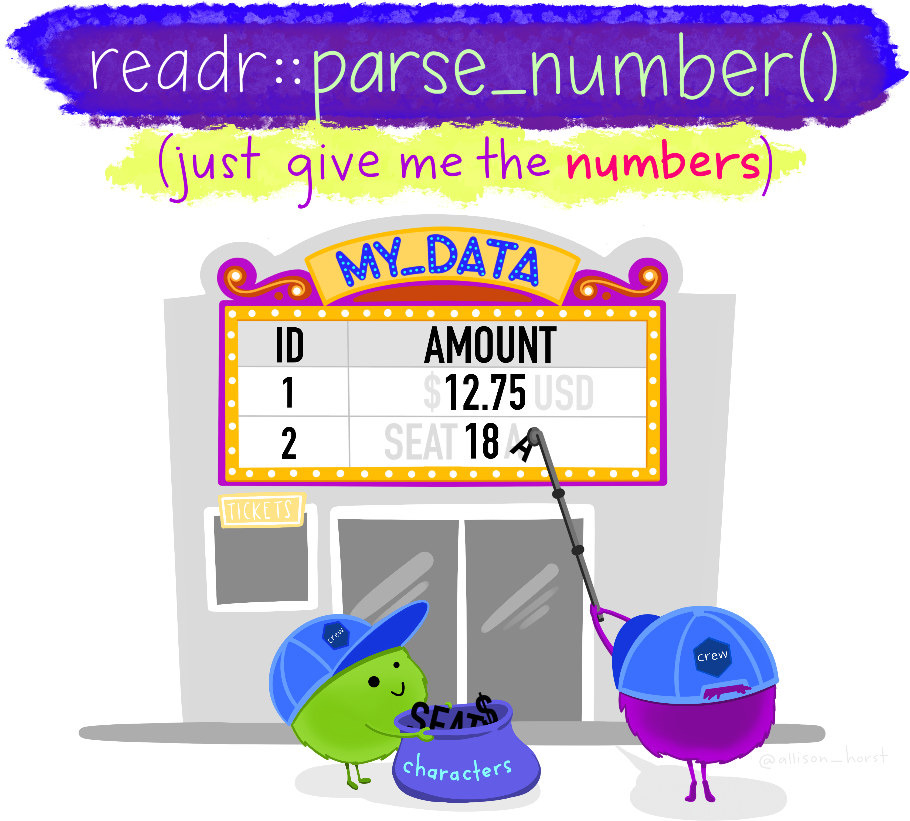
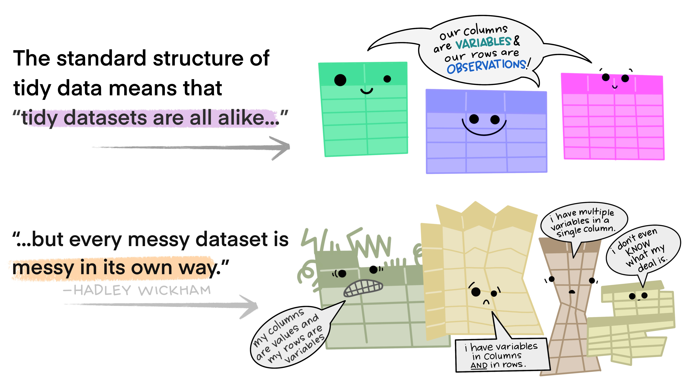
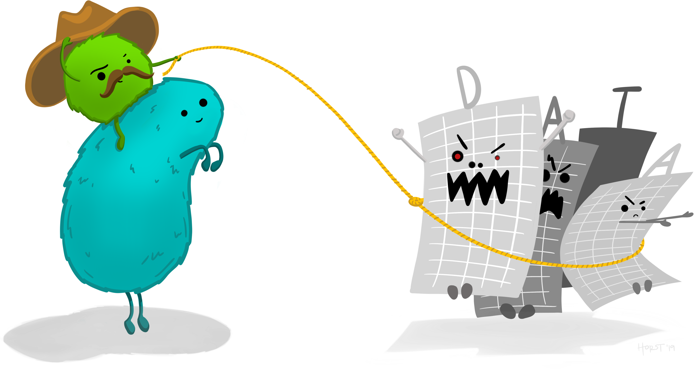

```{r setup, include=FALSE}
# Packages
library(learnr)
library(janitor)
library(lubridate)
library(tidyverse)
library(ggbeeswarm)

# Learnr options
knitr::opts_chunk$set(echo = FALSE)
options(shiny.port = 3838)
tutorial_options(exercise.eval = TRUE)

# Datasets
penguins <- read_csv("messy_penguins.csv")

# Functions
quiet_type_convert <- partial(type_convert, col_types = cols())

is_outlier <- function(x) {
  outliers <- boxplot.stats(x)$out
  x %in% outliers
}

plot_zscores <- function(data) {
  data %>% 
    pivot_longer(cols = where(is.numeric)) %>% 
    drop_na(value) %>% 
    group_by(name) %>% 
    mutate(value_scaled = scale(value),
           is_outlier = is_outlier(value)) %>% 
    ggplot(aes(x = name, y = value_scaled)) + 
    geom_quasirandom(aes(size = is_outlier, colour = is_outlier)) +
    scale_colour_manual(values = c(`TRUE` = "red", `FALSE` = "black"),
                        labels = c(`TRUE` = "Yes", `FALSE` = "No")) +
    scale_size_manual(values = c(`TRUE` = 1, `FALSE` = 0.1),
                      labels = c(`TRUE` = "Yes", `FALSE` = "No")) +
    coord_flip() +
    labs(x = "Column name", y = "Z-score", colour = "Is outlier?", 
         size = "Is outlier?")
}
```

```{css, echo=FALSE}
.video-container {
  position: relative;
  width: 100%;
  height: 0;
  padding-bottom: 56.25%;
}

.video-container iframe {
  position: absolute;
  top: 0;
  left: 0;
  width: 100%;
  height: 100%;
}

.section p img {
  max-height: 350px;
  margin: 2em auto 2em auto;
  object-fit: contain;
  display: block;
  margin: 2em auto;
  padding: 1em;
}

img.float-right {
  max-width: 450px;
  float: right;
  margin: 0 !important;
}

.section h1, .section h2, .section h3, .section h4 {
    clear: both;
}

a > code {
    color: #2fa4e7;
}

details > summary {
    font-weight: bold;
}
```

## Waiting Room

<div class="video-container"><iframe src="https://www.youtube.com/embed/9Iup70E0Ig0" frameborder="0" allow="accelerometer; autoplay; clipboard-write; encrypted-media; gyroscope; picture-in-picture" allowfullscreen></iframe></div>

## Introduction {data-progressive=FALSE}


### Welcome to this \#rstats workshop! 

{.float-right}

Please expect a hands-on session in a friendly and laid-back atmosphere where we all encouraged to learn together. All levels are welcome but be prepared that **we created this with beginners in mind**.

Everyone is welcome to join us at our events and to be a part of our mission to empower gender minorities with the skills and knowledge to code in one of the top programming language in data science, which is R.

To fulfill this mission we do ask participants to respect a focus on the encouragement and support for women and non-binary people during our events.

### Who are we?

#### Lead Instructor

{.float-right}

-   **Name:** Bruno Grande (he/him)

-   **Position:** Bioinformatics Engineer \@ Sage Bionetworks

-   **Training:**

    -   B.Sc. in Biochemistry

    -   Software Carpentry workshops

    -   Ph.D. in Bioinformatics

    -   Every day remains an opportunity to learn!

#### Workshop Helpers

-   Jasmine Lai

-   Yuka Takemon

-   Lucia Darrow

-   Lisa Cao


## Tidy data {data-progressive=FALSE}

### What is tidy data?



### Why is tidy data important? 

#### Tidy data for more efficient data science


#### Tidy data for easier collaboration



#### Tidy data for reproducibility and reuse



#### Tidy data for the win!


### Tidy data is your friend! 


## Today's dataset: Messy penguins!

Check out the [messy dataset](https://github.com/BrunoGrandePhD/2020-11-14-rladies-workshop/blob/main/learnr-tutorial/messy_penguins.csv) on GitHub!


**Important:** The actual dataset is nice and tidy. I purposely messed it up for this workshop. Don't hold it against the creators of the dataset. 


## Tidying column names

### Exercise #1


> **Objective**
> 
> Tidy the columns names of the `penguins` data frames by eliminating whitespace and special characters from the column names.

```{r tidy-column-names-1, exercise=TRUE}
tidy_penguins <- penguins

colnames(tidy_penguins)
```

```{r tidy-column-names-1-solution}
tidy_penguins <- penguins %>%
  clean_names()
```

<details>
<summary>Hint #1</summary>
<p>
You may want to check out the janitor [`clean_names()`](https://rdrr.io/cran/janitor/man/clean_names.html) function.
</p>
</details>

### Exercise #2



> **Objective**
> 
> Tidy the columns names once more, but use a different case this time (_i.e._ not snake case).

```{r tidy-column-names-2, exercise=TRUE}
tidy_penguins <- penguins %>%
  clean_names()

colnames(tidy_penguins)
```

**Hint:** You may want to check out the documentation for the janitor [`clean_names()`](https://rdrr.io/cran/janitor/man/clean_names.html) function.

```{r tidy-column-names-2-solution}
tidy_penguins <- penguins %>%
  clean_names(case = "big_camel")
```

<details>
<summary>Hint #1</summary>
<p>
You may want to check out the documentation for the janitor [`clean_names()`](https://rdrr.io/cran/janitor/man/clean_names.html) function.
</p>
</details>

<details>
<summary>Hint #2</summary>
<p>
You may want to check out the `case` argument for the janitor [`clean_names()`](https://rdrr.io/cran/janitor/man/clean_names.html) function.
</p>
</details>

## Reordering columns

### Exercise #1



> **Objective**
> 
> Place the `nickname` column at the beginning of the data frame. Note that the column names have been tidied up using snake case. 

```{r relocate-columns-1, exercise=TRUE}
tidy_penguins <- penguins %>%
  clean_names(case = "snake")

colnames(tidy_penguins)
```

```{r relocate-columns-1-solution}
tidy_penguins <- penguins %>%
  clean_names(case = "snake") %>% 
  relocate(nickname)
```

<details>
<summary>Hint #1</summary>
<p>
You may want to check out the dplyr [`relocate()`](https://dplyr.tidyverse.org/reference/relocate.html) function.
</p>
</details>

### Exercise #2

Upon closer inspection, you notice that there are three penguins named Carla. Hence, you realize that the sample number is a better identifier because it's guaranteed to be unique.

> **Objective**
> 
> Place the `nickname` column after the `sample_number` column.

```{r relocate-columns-2, exercise=TRUE}
tidy_penguins <- penguins %>%
  clean_names(case = "snake") %>% 
  relocate(nickname)

colnames(tidy_penguins)
```

```{r relocate-columns-2-solution}
tidy_penguins <- penguins %>%
  clean_names(case = "snake") %>% 
  relocate(nickname, .after = sample_number)
```

<details>
<summary>Hint #1</summary>
<p>
You may want to check out the documentation for the dplyr [`relocate()`](https://dplyr.tidyverse.org/reference/relocate.html) function.
</p>
</details>

<details>
<summary>Hint #2</summary>
<p>
You may want to check out the `.after` argument for the dplyr [`relocate()`](https://dplyr.tidyverse.org/reference/relocate.html) function.
</p>
</details>

## Filling in missing values

### Exercise #1

You'll notice that two columns in the [dataset](https://github.com/BrunoGrandePhD/2020-11-14-rladies-workshop/blob/main/learnr-tutorial/messy_penguins.csv) contain mostly missing values, namely `species` and `island`. Fortunately, you're told that this was just a shortcut done in Excel and that you can fill in values based on what's above. 

In other words, for the `species` column, the first third of the rows represents Adelie penguins, the second third represents Gentoo penguins, and the final third represents Chinstrap penguins. 

> **Objective**
> 
> Fix the missing values in the `species` column. 

```{r fill-missing-values-1, exercise=TRUE}
tidy_penguins <- penguins %>%
  clean_names(case = "snake") %>% 
  relocate(nickname, .after = sample_number)

head(tidy_penguins$species)
```

```{r fill-missing-values-1-solution}
tidy_penguins <- penguins %>%
  clean_names(case = "snake") %>% 
  relocate(nickname, .after = sample_number) %>% 
  fill(species)
```


<details>
<summary>Hint #1</summary>
<p>
You may want to check out the tidyr [`fill()`](https://tidyr.tidyverse.org/reference/fill.html) function.
</p>
</details>

### Exercise #2

Upon closer inspection, you realize that the `island` column has two missing values above the first valid value, `Torgersen`. After asking the researchers who generated the data, they confirm that `Torgersen` should have been at the top.

> **Objective**
> 
> Fix the missing values in the `island` column, but make sure that the first two rows also get fixed. 

```{r fill-missing-values-2, exercise=TRUE}
tidy_penguins <- penguins %>%
  clean_names(case = "snake") %>% 
  relocate(nickname, .after = sample_number) %>% 
  fill(species)

head(tidy_penguins$island)
```

```{r fill-missing-values-2-solution}
tidy_penguins <- penguins %>%
  clean_names(case = "snake") %>% 
  relocate(nickname, .after = sample_number) %>% 
  fill(species) %>% 
  fill(island, .direction = "downup")
```

<details>
<summary>Hint #1</summary>
<p>
You may want to check out the documentation for the tidyr [`fill()`](https://tidyr.tidyverse.org/reference/fill.html) function.
</p>
</details>

<details>
<summary>Hint #2</summary>
<p>
You may want to check out the `.direction` argument for the tidyr [`fill()`](https://tidyr.tidyverse.org/reference/fill.html) function.
</p>
</details>

## Handling dates

### Exercise #1



> **Objective**
> 
> Fix the `date_egg` column in place (_i.e._ don't create a new column) so that the values are stored as dates rather than characters. 

```{r tidy-dates-1, exercise=TRUE}
tidy_penguins <- penguins %>%
  clean_names(case = "snake") %>% 
  relocate(nickname, .after = sample_number) %>% 
  fill(species) %>% 
  fill(island, .direction = "downup")

str(tidy_penguins$date_egg)
```

```{r tidy-dates-1-solution}
tidy_penguins <- penguins %>%
  clean_names(case = "snake") %>% 
  relocate(nickname, .after = sample_number) %>% 
  fill(species) %>% 
  fill(island, .direction = "downup") %>% 
  mutate(date_egg = mdy(date_egg))
```

<details>
<summary>Hint #1</summary>
<p>
You may want to check out the dplyr [`mutate()`](https://dplyr.tidyverse.org/reference/mutate.html) function for adding a new column.
</p>
</details>

<details>
<summary>Hint #2</summary>
<p>
You may want to check out the lubridate [`ymd()`](https://lubridate.tidyverse.org/reference/ymd.html) group of functions for parsing the `date_egg` column.
</p>
</details>

<details>
<summary>Hint #3</summary>
<p>
Note that the dates in `date_egg` follow the MM/DD/YY format.
</p>
</details>

<details>
<summary>Hint #4</summary>
<p>
You may want to specifically check out the lubridate [`mdy()`](https://lubridate.tidyverse.org/reference/ymd.html) function.
</p>
</details>

### Exercise #2


Actually, you only care about the year and not the month or day. 

> **Objective**
> 
> Create a new column called `year_egg` that only contains the year as a plain numeric column.

```{r tidy-dates-2, exercise=TRUE}
tidy_penguins <- penguins %>%
  clean_names(case = "snake") %>% 
  relocate(nickname, .after = sample_number) %>% 
  fill(species) %>% 
  fill(island, .direction = "downup") %>% 
  mutate(date_egg = mdy(date_egg))

str(tidy_penguins$year_egg)
```

```{r tidy-dates-2-solution}
tidy_penguins <- penguins %>%
  clean_names(case = "snake") %>% 
  relocate(nickname, .after = sample_number) %>% 
  fill(species) %>% 
  fill(island, .direction = "downup") %>% 
  mutate(date_egg = mdy(date_egg),
         year_egg = year(date_egg))
```

<details>
<summary>Hint #1</summary>
<p>
You may want to check out the lubridate [`year()`](https://lubridate.tidyverse.org/reference/year.html) function.
</p>
</details>

### Exercise #3

Notice that the `year_egg` column was added at the end of the data frame. 

> **Objective**
> 
> Add the `year_egg` column such that it is located right after the `date_egg`. 

```{r tidy-dates-3, exercise=TRUE}
tidy_penguins <- penguins %>%
  clean_names(case = "snake") %>% 
  relocate(nickname, .after = sample_number) %>% 
  fill(species) %>% 
  fill(island, .direction = "downup") %>% 
  mutate(date_egg = mdy(date_egg),
         year_egg = year(date_egg))

colnames(tidy_penguins)
```

```{r tidy-dates-3-solution}
tidy_penguins <- penguins %>%
  clean_names(case = "snake") %>% 
  relocate(nickname, .after = sample_number) %>% 
  fill(species) %>% 
  fill(island, .direction = "downup") %>% 
  mutate(date_egg = mdy(date_egg),
         year_egg = year(date_egg),
         .after = date_egg)
```

<details>
<summary>Hint #1</summary>
<p>
You may want to check out the documentation for the dplyr [`mutate()`](https://dplyr.tidyverse.org/reference/mutate.html) function.
</p>
</details>

<details>
<summary>Hint #2</summary>
<p>
You may want to check out the `.after` argument for the dplyr [`mutate()`](https://dplyr.tidyverse.org/reference/mutate.html) function.
</p>
</details>

## Extracting numbers from text

### Exercise #1



The `body_mass` is quite messy. Not only is it not a numeric column as it should be (it's a character column), but it's not consistently formatted. 

> **Objective**
> 
> Tidy the `body_mass` column to only include the number of grams and no units.

```{r parse-number-1, exercise=TRUE}
tidy_penguins <- penguins %>%
  clean_names(case = "snake") %>% 
  relocate(nickname, .after = sample_number) %>% 
  fill(species) %>% 
  fill(island, .direction = "downup") %>% 
  mutate(date_egg = mdy(date_egg),
         year_egg = year(date_egg),
         .after = date_egg)

str(tidy_penguins$body_mass)
```

```{r parse-number-1-solution}
tidy_penguins <- penguins %>%
  clean_names(case = "snake") %>% 
  relocate(nickname, .after = sample_number) %>% 
  fill(species) %>% 
  fill(island, .direction = "downup") %>% 
  mutate(date_egg = mdy(date_egg),
         year_egg = year(date_egg),
         .after = date_egg) %>% 
  mutate(body_mass = parse_number(body_mass))
```

<details>
<summary>Hint #1</summary>
<p>
You may want to check out the readr [`parse_number()`](https://readr.tidyverse.org/reference/parse_number.html) function.
</p>
</details>

### Exercise #2

Now that you've tidied the `body_mass` column, you lost the important information that this column represents grams. 

> **Objective**
> 
> Tidy the `body_mass` column once again, but change the `body_mass` column name to indicate the units, _i.e._ `body_mass_g`. In other words, there shouldn't be a `body_mass` column. While you're at it, make sure that the new `body_mass_g` column isn't moved to the end of the data frame using what you've learned so far.

```{r parse-number-2, exercise=TRUE}
tidy_penguins <- penguins %>%
  clean_names(case = "snake") %>% 
  relocate(nickname, .after = sample_number) %>% 
  fill(species) %>% 
  fill(island, .direction = "downup") %>% 
  mutate(date_egg = mdy(date_egg),
         year_egg = year(date_egg),
         .after = date_egg) %>% 
  mutate(body_mass = parse_number(body_mass))

str(tidy_penguins$body_mass_g)
```

```{r parse-number-2-solution}
tidy_penguins <- penguins %>%
  clean_names(case = "snake") %>% 
  relocate(nickname, .after = sample_number) %>% 
  fill(species) %>% 
  fill(island, .direction = "downup") %>% 
  mutate(date_egg = mdy(date_egg),
         year_egg = year(date_egg),
         .after = date_egg) %>% 
  mutate(body_mass_g = parse_number(body_mass),
         .keep = "unused", .after = body_mass)
```

<details>
<summary>Hint #1</summary>
<p>
You may want to check out the documentation for the dplyr [`mutate()`](https://dplyr.tidyverse.org/reference/mutate.html) function.
</p>
</details>

<details>
<summary>Hint #2</summary>
<p>
You may want to check out the `.keep` argument for the dplyr [`mutate()`](https://dplyr.tidyverse.org/reference/mutate.html) function to determine which columns to keep.
</p>
</details>

<details>
<summary>Hint #3</summary>
<p>
You may want to check out the `.after` argument for the dplyr [`mutate()`](https://dplyr.tidyverse.org/reference/mutate.html) function to determine where to place new columns.
</p>
</details>

## Break time! 


<div class="video-container"><iframe src="https://www.youtube.com/embed/9Iup70E0Ig0" frameborder="0" allow="accelerometer; autoplay; clipboard-write; encrypted-media; gyroscope; picture-in-picture" allowfullscreen></iframe></div>

## Handling different NA values

### Exercise #1

Different values (_i.e._ `"-"`, `"--"`, `"."`, `"???"`, and `"N/A"`) were used to indicate that data is missing. This has a number of consequences: (1) it's inconsistent; (2) it prevents R from easily being able to exclude all missing values, and (3) it prevents numeric columns from being interpreted as such (now, they are parsed as character columns). For example, the `culmen_length_mm` and `culmen_depth_mm` columns are currently labelled as `chr` in the `str()` output.

> **Objective**
> 
> Tidy the missing values such that they are all represented by the special `NA` value.

```{r handle-na-values-1, exercise=TRUE}
tidy_penguins <- penguins %>%
  clean_names(case = "snake") %>% 
  relocate(nickname, .after = sample_number) %>% 
  fill(species) %>% 
  fill(island, .direction = "downup") %>% 
  mutate(date_egg = mdy(date_egg),
         year_egg = year(date_egg),
         .after = date_egg) %>% 
  mutate(body_mass_g = parse_number(body_mass),
         .keep = "unused", .after = body_mass)

str(tidy_penguins)
```

```{r handle-na-values-1-solution}
tidy_penguins <- penguins %>%
  clean_names(case = "snake") %>% 
  relocate(nickname, .after = sample_number) %>% 
  fill(species) %>% 
  fill(island, .direction = "downup") %>% 
  mutate(date_egg = mdy(date_egg),
         year_egg = year(date_egg),
         .after = date_egg) %>% 
  mutate(body_mass_g = parse_number(body_mass),
         .keep = "unused", .after = body_mass) %>% 
  type_convert(na = c("", "NA", "-", "--", ".", "N/A", "???"))
```

<details>
<summary>Hint #1</summary>
<p>
You may want to check out the documentation for the readr [`type_convert()`](https://readr.tidyverse.org/reference/type_convert.html) function.
</p>
</details>

<details>
<summary>Hint #2</summary>
<p>
You may want to check out the `na` argument for the readr [`type_convert()`](https://readr.tidyverse.org/reference/type_convert.html) function.
</p>
</details>

<details>
<summary>Hint #3</summary>
<p>
You may want to include the default values (_i.e._ `c("", "NA")`) in the value you provide to the `na` argument for the readr [`type_convert()`](https://readr.tidyverse.org/reference/type_convert.html) function.
</p>
</details>

## Creating multiple categories

### Exercise #1


Different values (_i.e._ `c("FEMALE", "MALE", "F", "f", "female", "male",, "M", "m")`) were used to indicate sex, which will complicate any sex-specific comparisons. 

> **Objective**
> 
> Tidy the `sex` column such that it only contains one value per sex in addition to `NA`. Consider adding a `unknown` category to catch anything that doesn't match one of your text patterns. Note that the function `quiet_type_convert()` is being used here (and for the rest of the tutorial) to avoid distracting output.

```{r tidy-categories-1, exercise=TRUE}
tidy_penguins <- penguins %>%
  clean_names(case = "snake") %>% 
  relocate(nickname, .after = sample_number) %>% 
  fill(species) %>% 
  fill(island, .direction = "downup") %>% 
  mutate(date_egg = mdy(date_egg),
         year_egg = year(date_egg),
         .after = date_egg) %>% 
  mutate(body_mass_g = parse_number(body_mass),
         .keep = "unused", .after = body_mass) %>% 
  quiet_type_convert(na = c("", "NA", "-", "--", ".", "N/A"))

unique(tidy_penguins$sex)
```

```{r tidy-categories-1-solution}
tidy_penguins <- penguins %>%
  clean_names(case = "snake") %>% 
  relocate(nickname, .after = sample_number) %>% 
  fill(species) %>% 
  fill(island, .direction = "downup") %>% 
  mutate(date_egg = mdy(date_egg),
         year_egg = year(date_egg),
         .after = date_egg) %>% 
  mutate(body_mass_g = parse_number(body_mass),
         .keep = "unused", .after = body_mass) %>% 
  quiet_type_convert(na = c("", "NA", "-", "--", ".", "N/A")) %>% 
  mutate(sex = tolower(sex),
         sex = case_when(sex %in% c("female", "f") ~ "female",
                         sex %in% c("male", "m")   ~ "male",
                         TRUE ~ "unknown"))
```

<details>
<summary>Hint #1</summary>
<p>
You may want to first transform the column such that the case (_i.e._ upper vs lower) is consistent. 
</p>
</details>

<details>
<summary>Hint #2</summary>
<p>
You may want to check out the base R [`tolower()`](https://stat.ethz.ch/R-manual/R-devel/library/base/html/chartr.html) and [`toupper()`](https://stat.ethz.ch/R-manual/R-devel/library/base/html/chartr.html) functions.
</p>
</details>

<details>
<summary>Hint #3</summary>
<p>
You may want to check out the dplyr [`case_when()`](https://dplyr.tidyverse.org/reference/case_when.html) function.
</p>
</details>

<details>
<summary>Hint #4</summary>
<p>
You may want to check out the examples for the dplyr [`case_when()`](https://dplyr.tidyverse.org/reference/case_when.html) function.
</p>
</details>

<details>
<summary>Hint #5</summary>
<p>
You may want to include a "fallback" condition for an `unknown` category using `TRUE` (see examples in [documentation](https://dplyr.tidyverse.org/reference/case_when.html)).
</p>
</details>

## Splitting a column

### Exercise #1

The `stage` column contains two pieces of information: the age group (_i.e._ adult vs juvenile) and the egg stage. Tidy data should ideally only have one variable per column.

> **Objective**
> 
> Split the `stage` column into two: `age_stage` and `egg_stage`.

```{r split-column-1, exercise=TRUE}
tidy_penguins <- penguins %>%
  clean_names(case = "snake") %>% 
  relocate(nickname, .after = sample_number) %>% 
  fill(species) %>% 
  fill(island, .direction = "downup") %>% 
  mutate(date_egg = mdy(date_egg),
         year_egg = year(date_egg),
         .after = date_egg) %>% 
  mutate(body_mass_g = parse_number(body_mass),
         .keep = "unused", .after = body_mass) %>% 
  quiet_type_convert(na = c("", "NA", "-", "--", ".", "N/A")) %>% 
  mutate(sex = tolower(sex),
         sex = case_when(sex %in% c("female", "f") ~ "female",
                         sex %in% c("male", "m")   ~ "male",
                         TRUE ~ "unknown"))

str(tidy_penguins)
```

```{r split-column-1-solution}
tidy_penguins <- penguins %>%
  clean_names(case = "snake") %>% 
  relocate(nickname, .after = sample_number) %>% 
  fill(species) %>% 
  fill(island, .direction = "downup") %>% 
  mutate(date_egg = mdy(date_egg),
         year_egg = year(date_egg),
         .after = date_egg) %>% 
  mutate(body_mass_g = parse_number(body_mass),
         .keep = "unused", .after = body_mass) %>% 
  quiet_type_convert(na = c("", "NA", "-", "--", ".", "N/A")) %>% 
  mutate(sex = tolower(sex),
         sex = case_when(sex %in% c("female", "f") ~ "female",
                         sex %in% c("male", "m")   ~ "male",
                         TRUE ~ "unknown")) %>% 
  separate(col = stage, into = c("age_stage", "egg_stage"), sep = ", ")
```

<details>
<summary>Hint #1</summary>
<p>
You may want to check out the tidyr [`separate()`](https://tidyr.tidyverse.org/reference/separate.html) function.
</p>
</details>

<details>
<summary>Hint #2</summary>
<p>
You may want to check out the `into` argument for the tidyr [`separate()`](https://tidyr.tidyverse.org/reference/separate.html) function, which expect a character vector (not "bare" column names).
</p>
</details>

<details>
<summary>Hint #3</summary>
<p>
You may want to check out the `sep` argument for the tidyr [`separate()`](https://tidyr.tidyverse.org/reference/separate.html) function, which splits the column based on any character.
</p>
</details>

### Exercise #2

> **Objective**
> 
> Fix the `egg_stage` column in place (_i.e._ no new column) to only contain the number component.

```{r split-column-2, exercise=TRUE}
tidy_penguins <- penguins %>%
  clean_names(case = "snake") %>% 
  relocate(nickname, .after = sample_number) %>% 
  fill(species) %>% 
  fill(island, .direction = "downup") %>% 
  mutate(date_egg = mdy(date_egg),
         year_egg = year(date_egg),
         .after = date_egg) %>% 
  mutate(body_mass_g = parse_number(body_mass),
         .keep = "unused", .after = body_mass) %>% 
  quiet_type_convert(na = c("", "NA", "-", "--", ".", "N/A")) %>% 
  mutate(sex = tolower(sex),
         sex = case_when(sex %in% c("female", "f") ~ "female",
                         sex %in% c("male", "m")   ~ "male",
                         TRUE ~ "unknown")) %>% 
  separate(col = stage, into = c("age_stage", "egg_stage"), sep = ", ")

str(tidy_penguins)
```

```{r split-column-2-solution}
tidy_penguins <- penguins %>%
  clean_names(case = "snake") %>% 
  relocate(nickname, .after = sample_number) %>% 
  fill(species) %>% 
  fill(island, .direction = "downup") %>% 
  mutate(date_egg = mdy(date_egg),
         year_egg = year(date_egg),
         .after = date_egg) %>% 
  mutate(body_mass_g = parse_number(body_mass),
         .keep = "unused", .after = body_mass) %>% 
  quiet_type_convert(na = c("", "NA", "-", "--", ".", "N/A")) %>% 
  mutate(sex = tolower(sex),
         sex = case_when(sex %in% c("female", "f") ~ "female",
                         sex %in% c("male", "m")   ~ "male",
                         TRUE ~ "unknown")) %>% 
  separate(col = stage, into = c("age_stage", "egg_stage"), sep = ", ") %>% 
  mutate(egg_stage = parse_number(egg_stage))
```

<details>
<summary>Hint #1</summary>
<p>
You may want to revisit how you used the readr [`parse_number()`](https://readr.tidyverse.org/reference/parse_number.html) function.
</p>
</details>

## Removing outliers

### Exercise #1

Once you start visualizing the data, you start seeing obvious outliers (and less obvious ones), so you need to handle them somehow.

> **Objective**
> 
> Remove all rows where one of the numeric columns is considered an outlier.

```{r fix-outliers-1, exercise=TRUE}
tidy_penguins <- penguins %>%
  clean_names(case = "snake") %>% 
  relocate(nickname, .after = sample_number) %>% 
  fill(species) %>% 
  fill(island, .direction = "downup") %>% 
  mutate(date_egg = mdy(date_egg),
         year_egg = year(date_egg),
         .after = date_egg) %>% 
  mutate(body_mass_g = parse_number(body_mass),
         .keep = "unused", .after = body_mass) %>% 
  quiet_type_convert(na = c("", "NA", "-", "--", ".", "N/A")) %>% 
  mutate(sex = tolower(sex),
         sex = case_when(sex %in% c("female", "f") ~ "female",
                         sex %in% c("male", "m")   ~ "male",
                         TRUE ~ "unknown")) %>% 
  separate(col = stage, into = c("age_stage", "egg_stage"), sep = ", ") %>% 
  mutate(egg_stage = parse_number(egg_stage))

plot_zscores(tidy_penguins)
```

```{r fix-outliers-1-solution}
tidy_penguins <- penguins %>%
  clean_names(case = "snake") %>% 
  relocate(nickname, .after = sample_number) %>% 
  fill(species) %>% 
  fill(island, .direction = "downup") %>% 
  mutate(date_egg = mdy(date_egg),
         year_egg = year(date_egg),
         .after = date_egg) %>% 
  mutate(body_mass_g = parse_number(body_mass),
         .keep = "unused", .after = body_mass) %>% 
  quiet_type_convert(na = c("", "NA", "-", "--", ".", "N/A")) %>% 
  mutate(sex = tolower(sex),
         sex = case_when(sex %in% c("female", "f") ~ "female",
                         sex %in% c("male", "m")   ~ "male",
                         TRUE ~ "unknown")) %>% 
  separate(col = stage, into = c("age_stage", "egg_stage"), sep = ", ") %>% 
  filter_if(is.numeric, all_vars(!is_outlier(.)))
```

<details>
<summary>Hint #1</summary>
<p>
You may want to check out the custom `is_outlier()` function that is provided to you here as a convenience, which returns a logical vector of where the corresponding values in the input vector are an outlier or not.
</p>
</details>

<details>
<summary>Hint #2</summary>
<p>
You may want to check out the dplyr [`filter_if()`](https://dplyr.tidyverse.org/reference/filter_all.html) function.
</p>
</details>

<details>
<summary>Hint #3</summary>
<p>
You may want to check out the examples for the dplyr [`filter_if()`](https://dplyr.tidyverse.org/reference/filter_all.html) function.
</p>
</details>

<details>
<summary>Hint #4</summary>
<p>
You may want to specifically check out the `all_vars()` examples for the dplyr [`filter_if()`](https://dplyr.tidyverse.org/reference/filter_all.html) function.
</p>
</details>

## Tidying data in spreadsheets

> "Happy families are all alike; every unhappy family is unhappy in its own way."
>
> ---Leo Tolstoy



Some practical recommendations for preparing data in spreadsheets:

1.  Be consistent

2.  Choose good names for things

3.  Write dates as YYYY-MM-DD

4.  No empty cells

5.  Put just one thing in a cell

6.  Make it a rectangle

7.  Create a data dictionary

8.  No calculations in the raw data files

9.  Do not use font colour or highlighting as data

10. Make backups

11. Use data validation to avoid errors

12. Save the data in plain text files

**Source:** Broman, KW and KH Woo (2018). *Data Organization in Spreadsheets*. [The American Statistician 72 (1)](https://doi.org/10.1080/00031305.2017.1375989). Available open access as a [PeerJ preprint](https://peerj.com/preprints/3183/).



## Acknowledgements


-   Friendly R, RStudio, and tidyverse communities
-   Google and StackOverflow
-   Some illustrations from the [Openscapes](https://www.openscapes.org/) blog [*Tidy Data for reproducibility, efficiency, and collaboration*](https://www.openscapes.org/blog/2020/10/12/tidy-data/) by Julia Lowndes and Allison Horst
-   Palmer Penguins dataset
    -   **Citation:** Gorman KB, Williams TD, Fraser WR (2014). Ecological sexual dimorphism and environmental variability within a community of Antarctic penguins (genus Pygoscelis). PLoS ONE 9(3):e90081. https://doi.org/10.1371/journal.pone.0090081
    -   **Package:** Horst AM, Hill AP, Gorman KB (2020). palmerpenguins: Palmer Archipelago (Antarctica) penguin data. R package version 0.1.0. https://allisonhorst.github.io/palmerpenguins/. doi: 10.5281/zenodo.3960218.
-   Additional artwork (_e.g._ Palmer penguins, cartoons) by @allison_horst
