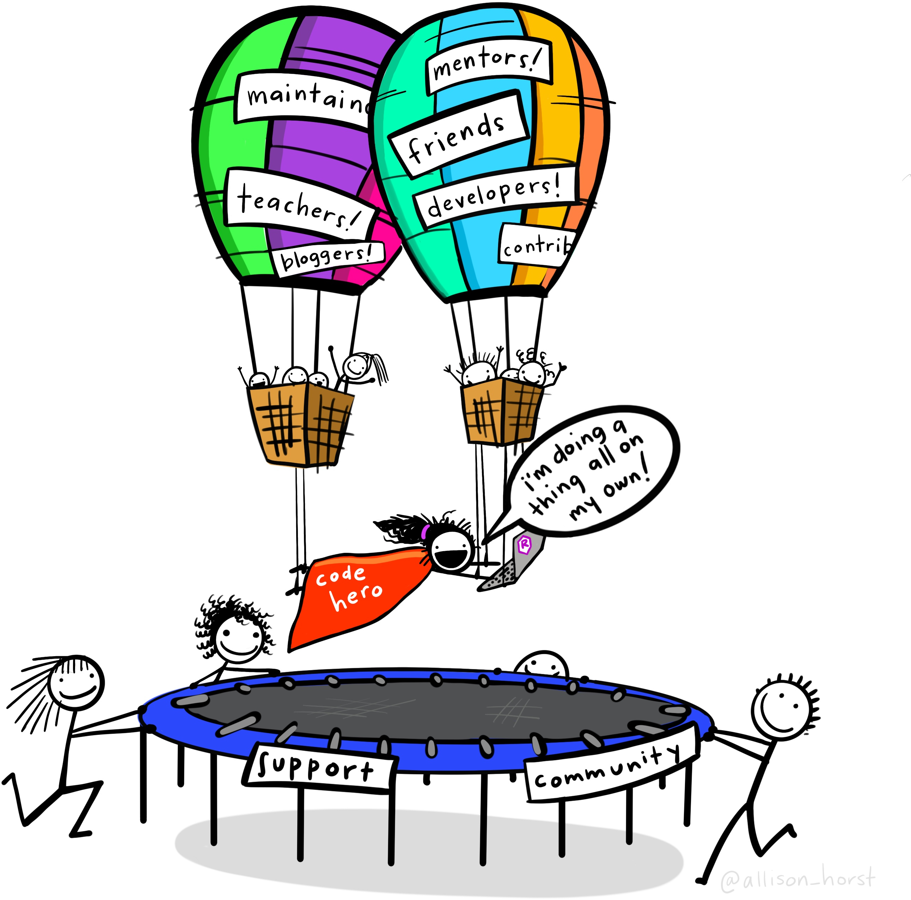

```{r setup, include=FALSE}
# Packages
library(learnr)
library(tidyverse)

# Learnr options
knitr::opts_chunk$set(echo = FALSE)
options(shiny.port = 3838)

# Datasets
penguins <- read_csv("messy_penguins.csv")
```

```{css, echo=FALSE}
.video-container {
  position: relative;
  width: 100%;
  height: 0;
  padding-bottom: 56.25%;
}

.video-container iframe {
  position: absolute;
  top: 0;
  left: 0;
  width: 100%;
  height: 100%;
}

.section p img {
  max-height: 350px;
  margin: 2em auto 2em auto;
  object-fit: contain;
  display: block;
  margin: 2em auto;
  padding: 1em;
}

img.float-right {
  max-width: 450px;
  float: right;
  margin: 0 !important;
}

.section h1, .section h2, .section h3, .section h4 {
    clear: both;
}
```

## Kitty Therapy

<div class="video-container"><iframe src="https://www.youtube.com/embed/9Iup70E0Ig0" frameborder="0" allow="accelerometer; autoplay; clipboard-write; encrypted-media; gyroscope; picture-in-picture" allowfullscreen></iframe></div>

## Introduction

### Welcome to this \#rstats workshop! 

{.float-right}

Please expect a hands-on session in a friendly and laid-back atmosphere where we all encouraged to learn together. All levels are welcome but be prepared that **we created this with beginners in mind**.

Everyone is welcome to join us at our events and to be a part of our mission to empower gender minorities with the skills and knowledge to code in one of the top programming language in data science, which is R.

To fulfill this mission we do ask participants to respect a focus on the encouragement and support for women and non-binary people during our events.

### Who are we?

#### Lead Instructor

{.float-right}

-   **Name:** Bruno Grande (he/him)

-   **Position:** Bioinformatics Engineer \@ Sage Bionetworks

-   **Training:**

    -   B.Sc. in Biochemistry

    -   Software Carpentry workshops

    -   Ph.D. in Bioinformatics

    -   Every day remains an opportunity to learn!

#### Workshop Helpers

-   Jasmine Lai

-   Yuka Takemon

-   Lucia Darrow

-   Lisa Cao


#### Acknowledgements

{.float-right}

-   Friendly R, RStudio, and tidyverse communities
-   Google and StackOverflow
-   Some illustrations from the [Openscapes](https://www.openscapes.org/) blog [*Tidy Data for reproducibility, efficiency, and collaboration*](https://www.openscapes.org/blog/2020/10/12/tidy-data/) by Julia Lowndes and Allison Horst
-   Palmer Penguins dataset
    -   **Citation:** Gorman KB, Williams TD, Fraser WR (2014). Ecological sexual dimorphism and environmental variability within a community of Antarctic penguins (genus Pygoscelis). PLoS ONE 9(3):e90081. https://doi.org/10.1371/journal.pone.0090081
    -   **Package:** Horst AM, Hill AP, Gorman KB (2020). palmerpenguins: Palmer Archipelago (Antarctica) penguin data. R package version 0.1.0. https://allisonhorst.github.io/palmerpenguins/. doi: 10.5281/zenodo.3960218.
-   Additional artwork (_e.g._ Palmer penguins, cartoons) by @allison_horst

## Tidy data

### What is tidy data?


### Why is tidy data important? 

#### Tidy data for more efficient data science


#### Tidy data for easier collaboration


#### Tidy data for reproducibility and reuse


#### Tidy data for the win!


### Tidy data is your friend! 


## Today's dataset: Messy penguins!


## Extracting numbers from text

Using `parse_number()`


## Tidying column names

Using `janitor`


## Creating multiple categories


## Break time! 


## Handling dates


## Pivoting data (wide ↔ long)


## Tidying data in spreadsheets

> "Happy families are all alike; every unhappy family is unhappy in its own way."
>
> ---Leo Tolstoy


Some practical recommendations for preparing data in spreadsheets:

1.  Be consistent

2.  Choose good names for things

3.  Write dates as YYYY-MM-DD

4.  No empty cells

5.  Put just one thing in a cell

6.  Make it a rectangle

7.  Create a data dictionary

8.  No calculations in the raw data files

9.  Do not use font colour or highlighting as data

10. Make backups

11. Use data validation to avoid errors

12. Save the data in plain text files

**Source:** Broman, KW and KH Woo (2018). *Data Organization in Spreadsheets*. [The American Statistician 72 (1)](https://doi.org/10.1080/00031305.2017.1375989). Available open access as a [PeerJ preprint](https://peerj.com/preprints/3183/).


